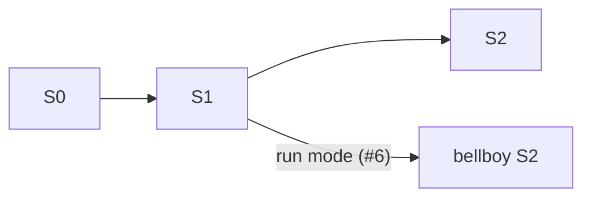

# Roadmap

- **Status:** Agreed with the maintainer on 2026-10-01
- **Reads with:** [`SPEC.md`](SPEC.md) says what habze is; this file says in what order it gets
  built. The board is <https://github.com/users/shoraLBRT/projects/5>.

**Work is taken from the board**: the first eligible issue of the earliest stage, then by Priority,
then by board position; an issue whose *blocked by* issues are still open waits. A stage is done when
its exit criterion has been shown to work, not when its issues are closed.

---

## Stages

| Stage | Goal | Exit criterion |
| --- | --- | --- |
| **S0 · The standard** | The rules are written down, checkably | `STANDARD.md` 1.0 exists; the labels file, issue forms and PR template are used by habze itself; habze's `main` is protected by a required CI check |
| **S1 · Skills and run mode** | The same skills everywhere, cloud included | The skills live in habze, read usage by the CLI probe, reach a project's cloud session without hand copying, and a manual fire with a run-mode payload completes an issue end to end following the routine guide |
| **S2 · Adoption** | Projects follow the standard | The conformance check passes on bellboy and ritocode |

**habze S1 blocks Bellboy S2**: Bellboy's run tracking reads the comments that run mode writes. Take
habze S0–S1 alongside Bellboy S0–S1.

---

## S0 · The standard

| # | Issue | Priority | Blocked by |
| --- | --- | --- | --- |
| [#1](https://github.com/shoraLBRT/habze/issues/1) | STANDARD.md 1.0 | P0 | — |
| [#2](https://github.com/shoraLBRT/habze/issues/2) | Labels file, issue forms and PR template | P1 | #1 |
| [#3](https://github.com/shoraLBRT/habze/issues/3) | habze CI and protection of main | P1 | — |

## S1 · Skills and run mode

| # | Issue | Priority | Blocked by |
| --- | --- | --- | --- |
| [#4](https://github.com/shoraLBRT/habze/issues/4) | Move the session skills into habze | P0 | #1 |
| [#5](https://github.com/shoraLBRT/habze/issues/5) | Usage probe in the skills | P0 | #4 |
| [#6](https://github.com/shoraLBRT/habze/issues/6) | Run mode for Bellboy | P0 | #4, #5 |
| [#7](https://github.com/shoraLBRT/habze/issues/7) | Do cloud sessions load a plugin enabled in the repository? | P0 | #4 |
| [#8](https://github.com/shoraLBRT/habze/issues/8) | Deliver the skills to projects | P0 | #7 |
| [#9](https://github.com/shoraLBRT/habze/issues/9) | Routine guide | P0 | #6 |

## S2 · Adoption

| # | Issue | Priority | Blocked by |
| --- | --- | --- | --- |
| [#10](https://github.com/shoraLBRT/habze/issues/10) | Conformance check | P1 | #1, #2 |
| [#11](https://github.com/shoraLBRT/habze/issues/11) | adopt-standard skill | P1 | #10, #8 |
| [#12](https://github.com/shoraLBRT/habze/issues/12) | Adopt the standard in bellboy | P1 | #11 |
| [#13](https://github.com/shoraLBRT/habze/issues/13) | Adopt the standard in ritocode | P1 | #11, #9 |

Other projects (RISL, mktba, …) are adopted the same way when the owner decides to connect them;
each gets its own issue then.
